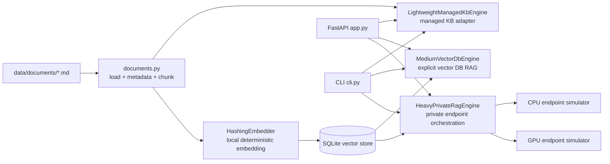
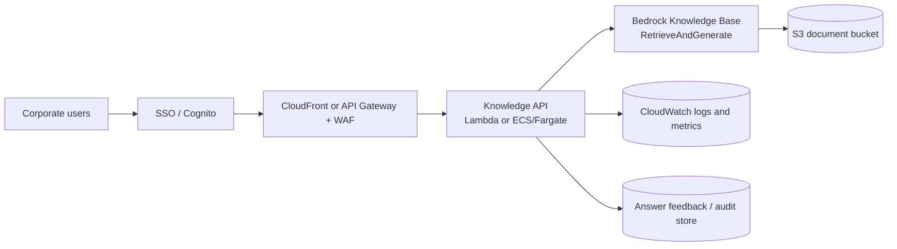
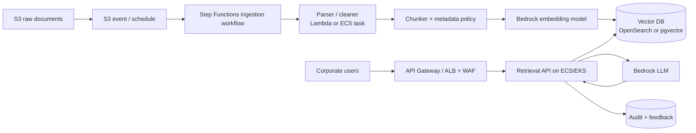
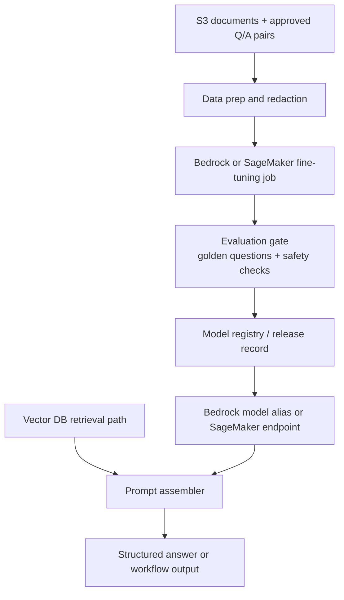

# Corporate Knowledge Base Architecture And VPC Design

This note shows the target network and runtime shapes for the three knowledge-base tiers.

## Runnable Three-Tier Code Architecture



The local code uses deterministic embeddings and SQLite so the PoC can run without cloud credentials. Production swaps the local adapters for Bedrock Knowledge Bases, pgvector/OpenSearch and private model endpoints without changing the tiered API contract.

## Tier 1: Lightweight S3 + Bedrock Knowledge Bases

Use this for a department knowledge base with a few thousand documents.



VPC view:

```text
AWS account
  VPC 10.0.0.0/16
    Public subnets
      - optional ALB
      - NAT Gateway only if private workloads need public AWS service egress

    Private app subnets
      - Lambda ENIs or ECS/Fargate knowledge API
      - no public IPs

    VPC endpoints
      - S3 Gateway Endpoint
      - CloudWatch Logs / ECR / Secrets Manager as needed
      - Bedrock interface endpoint where available; otherwise controlled NAT egress

  AWS managed services outside customer subnets
    - S3 document bucket
    - Bedrock Knowledge Bases
    - CloudWatch
    - IAM / KMS
```

Design notes:

- Keep document storage in S3 with KMS encryption and bucket policies.
- Keep the app runtime in private subnets when it needs access to internal systems.
- The API should never expose a raw model key or broad S3 permissions to the browser.
- Use document metadata such as department, owner, effective date and confidentiality level even in the lightweight tier.

## Tier 2: Medium RAG With Explicit Vector DB

Use this when the team needs custom chunking, hybrid search, metadata filters, reranking or multi-department isolation.



VPC view:

```text
AWS account
  VPC 10.0.0.0/16
    Public subnets
      - internet-facing ALB only if the API is externally reachable
      - NAT Gateway if required

    Private app subnets
      - ECS/Fargate service or EKS worker nodes
      - ingestion workers
      - retrieval API
      - optional reranker service

    Private data subnets
      - Aurora PostgreSQL with pgvector, if chosen
      - self-managed Milvus dependencies, if chosen

    Managed service endpoints
      - OpenSearch Serverless VPC endpoint, if chosen
      - S3 Gateway Endpoint
      - Bedrock / CloudWatch / ECR / Secrets Manager endpoints where available

  Shared services
    - S3 raw and processed buckets
    - KMS keys
    - CloudWatch dashboards
    - IAM roles and service accounts
```

Security guardrails:

- Vector DB stays private; no public endpoint.
- Metadata filters are enforced server-side, not only in the UI.
- S3 buckets are encrypted, versioned and access-logged.
- Secrets live in Secrets Manager or Kubernetes External Secrets, not in repository files.
- Every answer logs request ID, user, retrieved chunk IDs, model ID and latency.

## Tier 3: Fine-Tuning And Private Runtime

Fine-tuning should be added after RAG has a measured quality baseline.



CPU deployment consideration:

| Choice | When it works | Risk |
| --- | --- | --- |
| CPU embedding worker | Often acceptable for low or scheduled throughput | Slower bulk indexing |
| CPU reranker | Acceptable for small top-k and low QPS | Adds user-facing latency |
| CPU LLM generation | Private fallback, batch jobs or low-QPS internal tools | Seconds to tens of seconds depending on model and hardware |
| GPU LLM endpoint | Interactive private inference | Higher fixed cost and capacity planning |

## Latency Budget

| Path | Typical bottleneck | Practical note |
| --- | --- | --- |
| Tier 1 Bedrock KB | LLM generation and managed retrieval | Best for speed of implementation |
| Tier 2 vector DB | LLM generation; retrieval if index/filtering is poorly tuned | Use HNSW/IVF index, metadata filters and bounded top-k |
| Tier 2 with reranker | Reranker and LLM | Keep reranking top-k small |
| CPU generation | Model decoding | Use async workflow or fallback message when latency is strict |

## Instance And Zone Selection

MVP1 should avoid unnecessary always-on infrastructure. MVP2 can add managed data services and optional GPU only after quality and security are proven.

| Layer | MVP1 recommended shape | MVP2 recommended shape |
| --- | --- | --- |
| Availability zones | Two AZs for private app subnets; S3 and Bedrock are managed regional services | Two or three AZs depending HA target; app and data subnets separated |
| API runtime | Lambda or ECS/Fargate in private subnets | ECS/Fargate or EKS service; optional Java/Spring Boot API built by Maven |
| Ingestion workers | Lambda for small files or short parsing jobs | ECS task, EKS CronJob or Step Functions workflow for larger parsing/chunking |
| Vector DB | Bedrock Knowledge Bases managed storage path | Aurora PostgreSQL pgvector in private data subnets or OpenSearch Serverless with VPC endpoint |
| CPU inference | Not needed for main path | Acceptable for low-QPS private fallback, reranking or batch summarization |
| GPU inference | Not needed | Optional G5/A10G or managed SageMaker endpoint for private low-latency generation |
| CI runner | GitLab/GitHub managed runner or small private runner | GitLab/Jenkins/Azure DevOps runner in separate CI namespace/cluster; avoid production app namespace |
| EIP / fixed public IP | Avoid by default; use DNS/load balancer or Cloudflare Tunnel | Use EIP only for fixed NAT egress, bastion-like demo VM or allow-list integration |
| Ansible | Optional for VM bootstrap: Python, Nginx, systemd, env file | Useful for hybrid VM estates; Terraform should still own VPC, subnets, security groups and managed services |

Reference VPC shape for MVP2:

```text
VPC 10.0.0.0/16
  AZ-a
    public-subnet-a: optional ALB, NAT Gateway
    private-app-subnet-a: API pods/tasks, ingestion workers, GitLab runner agents if allowed
    private-data-subnet-a: Aurora writer/reader or private data dependencies

  AZ-b
    public-subnet-b: optional ALB, NAT Gateway
    private-app-subnet-b: API pods/tasks, ingestion workers
    private-data-subnet-b: Aurora standby/reader or private data dependencies

  VPC endpoints
    S3 Gateway Endpoint
    ECR, CloudWatch Logs, Secrets Manager, STS
    Bedrock endpoint where available or controlled NAT egress
    OpenSearch Serverless VPC endpoint if selected
```

GPU placement rule:

```text
Use Bedrock for MVP1 and default MVP2.
Use GPU only when private inference is a stated requirement or Bedrock latency/cost is unacceptable.
Keep GPU endpoints off the critical path until the fallback and cost controls are proven.
```

## Recommended Starting Architecture

For a first internal automation PoC:

```text
CloudFront or API Gateway
  -> Lambda or ECS/Fargate Knowledge API in private subnets
  -> Bedrock Knowledge Base
  -> S3 document bucket
  -> CloudWatch + feedback store
```

Then add explicit vector DB only when the lightweight managed path cannot meet retrieval, filtering or ownership requirements.
